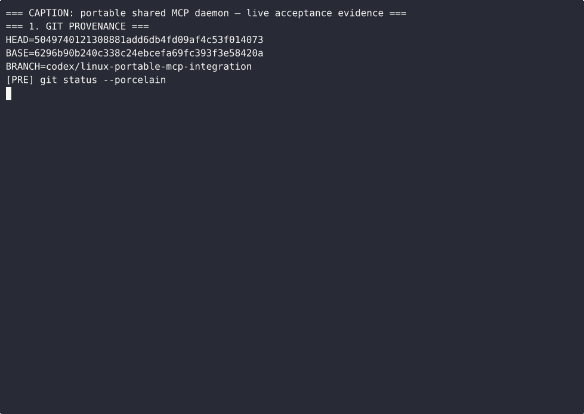

# user_scope PR #45 — portable shared MCP evidence

This public repository contains the sanitized terminal and raw runtime evidence for [`jleechanorg/user_scope` PR #45](https://github.com/jleechanorg/user_scope/pull/45) at commit `5049740121308881add6db4fd09af4c53f014073`.

## Evidence



- [Evidence report](evidence.md)
- [Clean-machine reproduction gist](https://gist.github.com/jleechan2015/cdec09831b02b9f0a30f86b9c51a17af)
- [Downloadable MP4](https://github.com/jleechanorg/user-scope-pr45-evidence-20260827/releases/download/pr45-iteration-003/terminal-evidence.mp4)
- [Sanitized evidence archive](https://github.com/jleechanorg/user-scope-pr45-evidence-20260827/releases/download/pr45-iteration-003/iteration_003-sanitized.tar.gz)

Verify the checked-in files with:

```bash
sha256sum -c public-checksums.sha256
```

The evidence proves the recorded behavior on one Linux host. It does not prove long-duration freeze immunity, execution on a second machine, macOS behavior, or unavailable WorldAI/Aside endpoints.
